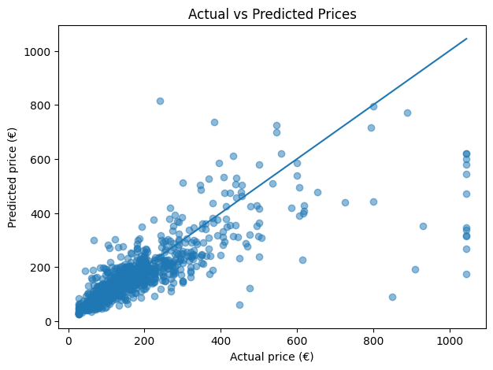
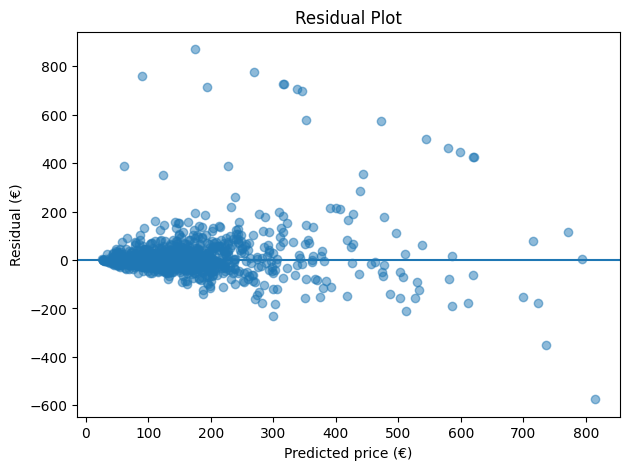
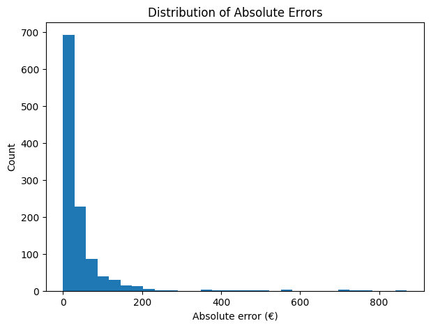

# Airbnb Basque Country Price Prediction

## Table of Contents

- [1. Dataset](#1-dataset)
- [2. Project Structure](#2-project-structure)
- [3. Exploratory Data Analysis](#3-exploratory-data-analysis)
- [3.1. Features Selected for Modeling](#31-features-selected-for-modeling)
- [4. Creating the Pipelines, Training the Models and the Final Evaluation](#4-creating-the-pipelines-training-the-models-and-the-final-evaluation)
- [4.1. Model Comparison](#41-model-comparison)
- [4.2. Final Results and Evaluations](#42-final-results-and-evaluations)
- [4.2.1. Random Sample of Predictions](#421-random-sample-of-predictions)
- [4.2.2. Worst Predictions](#422-worst-predictions)
- [4.2.3. Best Predictions](#423-best-predictions)
- [4.3. Diagnostic Plots](#43-diagnostic-plots)
- [4.3.1. Actual vs Predicted Prices](#431-actual-vs-predicted-prices)
- [4.3.2. Residual Plot](#432-residual-plot)
- [4.3.3. Distribution of Absolute Errors](#433-distribution-of-absolute-errors)
- [5. How to Run](#5-how-to-run)
- [6. Limitations and Future Improvements](#6-limitations-and-future-improvements)

The goal of this project is to analyze and predict Airbnb listing prices in the Basque Country, where I am currently based. With its coastal and mountainous areas, the region attracts both nature- and culture-oriented tourism, which makes Airbnb price analysis a worthwhile task. The dataset was obtained from [Inside Airbnb](https://insideairbnb.com/get-the-data/)

Because the task involves predicting labeled outcomes, it is a supervised machine learning problem. Since the target is a continuous numerical value, it is specifically a regression problem. In this project, I used three different models and selected the best one based on cross-validation performance on the training set.

As a linear baseline, I used Ridge Regression because the dataset contains many features that are highly correlated with one another. I also used two tree-based ensemble models: Random Forest and Gradient Boosting. These models were better able to capture nonlinear relationships between the features and price than Ridge Regression, suggesting that much of the structure in the data is nonlinear.

Among the three, Gradient Boosting performed best. Its advantage comes from building trees sequentially, with each new tree learning to correct the errors of the previous ones. This allows it to reduce bias effectively while still modeling complex nonlinear patterns.

## 1. Dataset

The dataset is relatively small, containing 6,339 rows and 79 columns. It includes Airbnb listings across the Basque Country, with a higher concentration around Bilbao, Donostia-San Sebastián, and Vitoria-Gasteiz.

The features can be grouped into the following categories:

- irrelevant identifiers such as IDs and URLs
- text features such as description and host_about
- features with clear information leakage, such as estimated_revenue and occupancy
- property-related features such as accommodates and room_type
- host and host-reputation features such as host_since and review-related variables
- location features such as neighbourhood

Irrelevant identifier columns were removed at the beginning of the project. Text features were also excluded, as text analysis is being reserved for a separate project.

## 2. Project Structure

The schema of the project structure:

```text
Airbnb_Basque_Country_Price_Prediction/
├── data/
│   └── listings.csv                 # Raw Airbnb dataset
├── notebooks/
│   ├── 01_data_exploration.ipynb    # EDA and preprocessing decisions
│   └── 02_model_test.ipynb          # Pipelines, model training, and evaluation
├── .gitignore
├── README.md
└── requirements.txt

Recommended reading order: first 01_data_exploration.ipynb, then 02_model_test.ipynb

## 3. Exploratory Data Analysis

Structure:

1. **Import and Load Data**
2. **Initial Data Cleaning and Column Dropping**
3. **Train/Test Split**
4. **Exploratory Data Analysis**
   - **4.a. Analysis of Numerical Features**
   - **4.b. Analysis of Categorical Features**
   - **4.c. Host Tenure Analysis**
   - **4.d. Analysis of Amenities**
   - **4.e. Missing Values**

EDA begins with importing libraries, loading the data, and performing initial cleaning such as converting the strings that are essentially numbers to numeric values, including the removal of irrelevant columns and text features. These steps are followed immediately by a train-test split to prevent data leakage, so the entire EDA is conducted only on the training set.

I used a stratified train-test split based on price bins created from 5 quantiles, with an 80–20 train-test ratio. This helps preserve a similar distribution of lower- and higher-priced listings across both sets. 

In the fourth section, I analyzed the training set after the split and used the results to guide feature selection and preprocessing decisions.

First, I examined the **numerical features**, focusing on their distributions, skewness, and relationship with **log_price**. For highly skewed variables, I tested log and clipping transformations and kept the versions that appeared more useful based on correlation checks. I also analyzed the **geographical variables** and created distance-based features such as **distance_to_center** (this should be interpreted as **distance_to_bilbao**, since the feature was originally named when I thought the dataset only contained listings from Bilbao), **distance_to_donostia**, **distance_to_vitoria**, and **distance_to_coast**. These engineered features were intended to capture location effects more meaningfully than raw coordinates, especially for linear models. The reference locations were chosen based on the main concentration areas observed in the geographical plots. 

Next, I analyzed the **categorical features** by checking their cardinality, frequency distribution, and relationship with **log_price**. I dropped some less useful or redundant columns, grouped rare categories into **"Other"** for high-cardinality variables such as **property_type** and **neighbourhood_cleansed**, and kept the cleaner location variable that best balanced detail and consistency.

I then carried out a **host tenure analysis** by converting date columns into datetime format and creating **host_experience_days** and **host_experience_years**. This was done to test whether more experienced hosts tend to charge different prices.

After that, I analyzed **amenities** by parsing the text-based amenities lists into structured form. I identified common amenities, compared their price patterns, examined the amenities of the most expensive listings, and created simplified luxury-related indicators such as **has_luxury_amenity** and **luxury_amenity_count**.

Finally, I reviewed the **missing values** in the dataset. Based on their meaning and proportion, I decided that review-related variables would be imputed with **0** to reflect the absence of reviews, while a few numeric housing variables with very small missingness would be imputed with the median.

### 3.1. Features Selected for Modeling

Based on the EDA, the following groups of features were carried forward into the modeling stage:

* List of numerical columns to keep:
    - log_price
    - host_listings_count
    - host_total_listings_count
    - log_accommodates
    - bathrooms_clipped
    - bedrooms_clipped
    - beds_clipped
    - log_minimum_nights_clipped
    - log_maximum_nights_clipped
    - availability_30
    - availability_90
    - availability_365
    - log_number_of_reviews
    - log_reviews_per_month
    - review_scores_rating
    - review_scores_cleanliness
    - review_scores_location
    - calculated_host_listings_count_entire_homes
    - calculated_host_listings_count_private_rooms
    - calculated_host_listings_count_shared_rooms
    - host_acceptance_rate_clipped
    - distance_to_coast
    - distance_to_vitoria
    - distance_to_donostia
    - distance_to_center
    - longitude
    - latitude

* List of categorical columns to keep
    - host_is_superhost
    - host_has_profile_pic
    - neighbourhood_cleansed_clean
    - property_type_clean
    - room_type
    - instant_bookable
    - host_experience_days
    - 99 most frequent amenities encoded
    - has_luxury_amenity
    - luxury_amenity_count

135 features in total has been chosen for the models.

## 4. Creating the Pipelines, Training the Models and the Final Evaluation

This notebook implements the full **model development and evaluation pipeline** for the Airbnb Basque Country dataset.

It starts by loading the cleaned dataset, preparing the target variable, and applying the same **stratified train-test split** used in the EDA workflow. The target variable is transformed into `log_price`, and clipping is applied based only on the training set in order to reduce the effect of extreme values while avoiding leakage into the test set.

The notebook then defines a set of **helper functions** and **custom transformers** to make preprocessing reproducible inside scikit-learn pipelines. These transformers handle tasks such as dropping unnecessary columns, cleaning price and percentage fields, clipping and log-transforming skewed variables, encoding amenities, creating host-experience variables, engineering distance-based location features, mapping binary variables, and reducing high-cardinality categorical features by grouping rare categories into `"Other"`.

After that, I selected the input features and built separate preprocessing pipelines for different model families. The workflow distinguishes between the needs of **Ridge Regression** and the tree-based models, applying scaling where necessary and allowing each model to receive the transformations most appropriate to it.

I then trained and tuned three candidate models: **Ridge Regression**, **Random Forest**, and **HistGradientBoostingRegressor**. Ridge was tuned with **GridSearchCV**, while Random Forest and HistGradientBoosting were tuned with **RandomizedSearchCV**. Their performance was compared using **cross-validated RMSE on the log-transformed target**.

Among the tested models, **HistGradientBoostingRegressor** achieved the best cross-validation result, so it was selected as the final model. I then evaluated it on the held-out test set using both the **log scale** and the **original dollar scale**, reporting RMSE, MAE, Median Absolute Error, and R².

Finally, I performed a set of **diagnostic checks**, including actual-versus-predicted comparisons, worst and best prediction examples, a residual plot, and the distribution of absolute errors. These diagnostics showed that the model captures the general pricing structure reasonably well, but has more difficulty with extreme or atypical listings.

### 4.1. Model Comparison

The candidate models were compared using cross-validated RMSE on the log-transformed target over the training set.

| Model | CV RMSE (log scale) |
|-------|----------------------|
| HistGradientBoostingRegressor | 0.3341 |
| Random Forest | 0.3632 |
| Ridge Regression | 0.4234 |

Based on cross-validation performance, **HistGradientBoostingRegressor** was selected as the final model. The cross-validation results suggest that tree-based ensemble models capture the pricing structure better than the linear baseline. In particular, HistGradientBoosting achieved the lowest validation error, which indicates that nonlinear relationships play an important role in this dataset.

### 4.2. Final Results and Evaluations

**Note:** Although I referred to the target as being in euros in the model notebook because the listings are located in the Basque Country, the original price variable in the dataset is **actually** denominated in U.S. dollars.

The final selected model was evaluated on the held-out test set using both log-scale and euro-scale error metrics.

- **RMSE (log scale):** 0.3256  
- **RMSE ($):** 95.45  
- **MAE ($):** 44.13  
- **Median Absolute Error ($):** 20.62  
- **R²:** 0.5945  

These results suggest that the model captures a meaningful part of the variation in Airbnb prices, although prediction errors remain larger for some listings, especially atypical or high-priced ones. The gap between **MAE** and **Median Absolute Error** also indicates that a smaller number of difficult cases still produce relatively large errors. 

With an **R² of 0.5945**, the model explains about **59.5% of the variance** in listing prices on the test set. This suggests a moderate predictive fit: the model captures much of the general pricing structure, but not all of the factors driving price differences.

To better understand the model's behavior, I examined three groups of predictions on the test set: a random sample, the worst predictions, and the best predictions:

#### 4.2.1. Random Sample of Predictions

The random sample shows that the model often produces reasonably close estimates for ordinary listings, although some medium-sized errors remain.

| Actual Price ($) | Predicted Price ($) | Absolute Error ($) | Percentage Error ($) |
|------------------|---------------------|--------------------|----------------------|
| 75.00            | 127.89              | 52.89              | 70.52                |
| 93.00            | 82.55               | 10.45              | 11.23                |
| 156.00           | 232.49              | 76.49              | 49.03                |
| 32.00            | 40.57               | 8.57               | 26.78                |
| 71.00            | 64.86               | 6.14               | 8.65                 |
| 105.00           | 107.07              | 2.07               | 1.97                 |
| 89.00            | 137.62              | 48.62              | 54.63                |
| 138.00           | 128.87              | 9.13               | 6.62                 |
| 193.00           | 220.36              | 27.36              | 14.18                |
| 203.00           | 212.60              | 9.60               | 4.73                 |

#### 4.2.2. Worst Predictions

The worst predictions are mostly associated with very expensive listings. In these cases, the model often strongly underestimates the actual price, which suggests that rare luxury or highly atypical listings are not well represented by the general pricing patterns learned from the data.

| Actual Price ($) | Predicted Price ($) | Absolute Error ($) | Percentage Error (%) |
|------------------|---------------------|--------------------|----------------------|
| 1044.62          | 174.18              | 870.44             | 83.33                |
| 1044.62          | 268.97              | 775.65             | 74.25                |
| 850.00           | 90.20               | 759.80             | 89.39                |
| 1044.62          | 315.86              | 728.76             | 69.76                |
| 1044.62          | 316.47              | 728.15             | 69.70                |
| 909.00           | 193.47              | 715.53             | 78.72                |
| 1044.62          | 337.33              | 707.29             | 67.71                |
| 1044.62          | 345.96              | 698.66             | 66.88                |
| 931.00           | 352.69              | 578.31             | 62.12                |
| 240.00           | 815.02              | 575.02             | 239.59               |

#### 4.2.3. Best Predictions

The best predictions show that the model can estimate many standard listings with very high accuracy when they follow the dominant patterns in the dataset.

| Actual Price ($) | Predicted Price ($) | Absolute Error ($) | Percentage Error (%) |
|------------------|---------------------|--------------------|----------------------|
| 64.00            | 63.99               | 0.01               | 0.01                 |
| 93.00            | 92.99               | 0.01               | 0.01                 |
| 27.00            | 27.05               | 0.05               | 0.17                 |
| 225.00           | 224.93              | 0.07               | 0.03                 |
| 116.00           | 115.93              | 0.07               | 0.06                 |
| 106.00           | 105.90              | 0.10               | 0.10                 |
| 27.00            | 26.89               | 0.11               | 0.42                 |
| 196.00           | 195.87              | 0.13               | 0.07                 |
| 214.00           | 213.84              | 0.16               | 0.07                 |
| 73.00            | 72.75               | 0.25               | 0.34                 |

Overall, these results suggest that the model performs reasonably well for typical listings, but struggles more with rare, very high-priced, or otherwise unusual properties. This pattern is consistent with the earlier observation that extreme listings are harder to model reliably, even after transforming and clipping the target variable.

### 4.3. Diagnostic Plots

Taken together, the diagnostic plots show that the model captures the general pricing structure of the dataset reasonably well, especially for typical low- and mid-priced listings. However, the errors become larger and more dispersed for expensive or unusual properties, with a tendency to underpredict many high-price listings. The error distribution also shows that, although most predictions are fairly close to the true values, a smaller number of difficult cases produce very large errors. Overall, the model is useful for the bulk of the dataset, but less reliable at the extremes.

#### 4.3.1. Actual vs Predicted Prices



#### 4.3.2. Residual Plot



#### 4.3.3. Distribution of Absolute Errors



## 5. How to Run

This project is notebook-based. The raw dataset is already included at `data/listings.csv`, and the analysis can be reproduced by running the notebooks in order.

1. Clone the repository and move into the project folder.
2. Create and activate a virtual environment.
3. Install the required libraries.
4. Start Jupyter Notebook.
5. Run `notebooks/01_data_exploration.ipynb` first, then `notebooks/02_model_test.ipynb`.

Example setup:

```bash
git clone <your-repository-url>
cd Airbnb_Basque_Country_Price_Prediction
python3 -m venv .venv
source .venv/bin/activate
pip install -r requirements.txt
jupyter notebook
```
Then open the notebooks from the Jupyter interface and run them cell by cell in the recommended order.

## 6. Limitations and Future Improvements

One limitation of this project is that it relies only on structured tabular features. Text variables such as listing descriptions, neighbourhood overviews are excluded, even though they may contain useful information about perceived quality, style, and guest experience. The model also performs less reliably on rare or very expensive listings.

A possible next step would be to process these text features and test whether they improve price prediction. This could help capture information that is currently missing from the structured data alone. 
